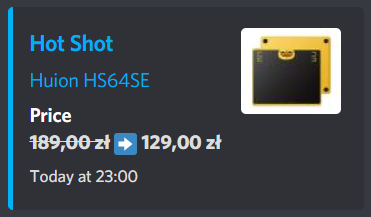

# Hot Shot Bot

Discord webhook bot for notifying about X-Kom.pl "Hot Shots".

Hot Shots are quick product sales with limited amounts of stock. This bot can help you get notifications about new Hot Shots quicker than in the mobile app, which can sometimes be late.



## Setup
Set the environment variable `WEBHOOK_URL` to a webhook URL. You can use the `.env` file for that.


(Optional) Create a virtual environment:
```sh
python -m venv venv
source venv/bin/activate
```

Install all project requirements:
```sh
python -m pip install -r requirements.txt
```

And run the bot:
```sh
python main.py
```

Alternatively, you can build a Docker image using the included [Dockerfile](Dockerfile).
